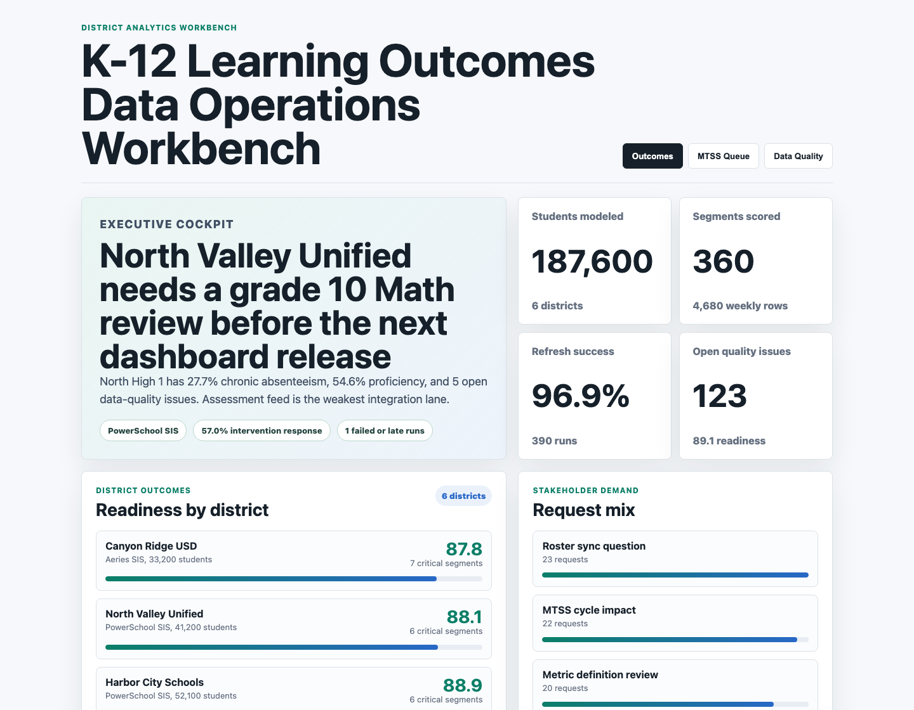
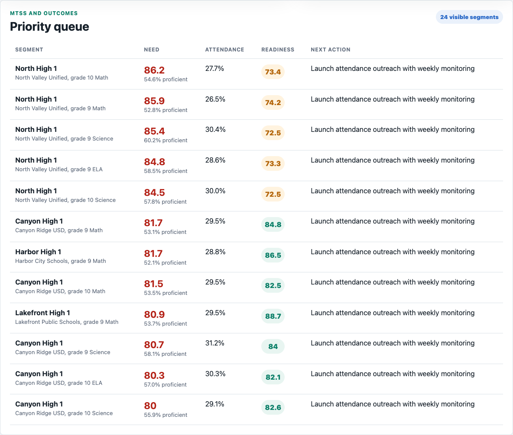
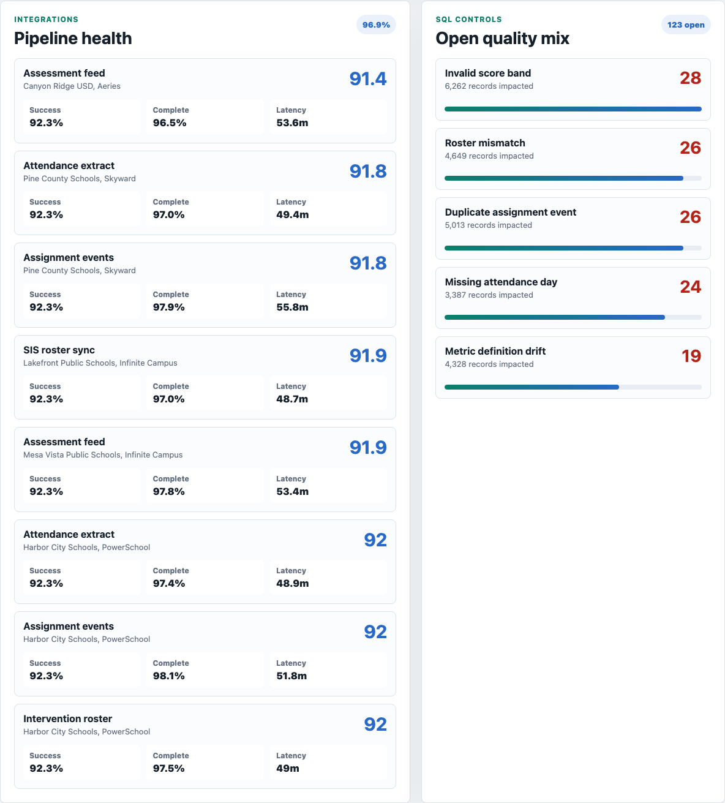

# K-12 Learning Outcomes Data Operations Workbench

This project is a district-facing analytics workbench for K-12 learning outcomes, attendance, MTSS intervention review, and dashboard data reliability. It is built for the practical problem behind education analytics: district leaders need clear student outcome signals, and analytics teams need to know whether the underlying SIS, assessment, attendance, and intervention data is trustworthy enough to publish.

The artifact combines an executive outcomes cockpit, an MTSS priority queue, and an integration/data-quality command center. The goal is to show how an Educational Data Analyst can translate messy source data into digestible decisions while also diagnosing the data-quality issues that make district dashboards unreliable.



**Executive district outcomes cockpit:** Summarizes modeled student scale, scored outcome segments, refresh success, open quality issues, district readiness, and stakeholder request demand.



**MTSS priority queue:** Ranks school-grade-subject segments by proficiency, growth, chronic absenteeism, assignment completion, intervention response, student impact, and dashboard readiness.



**Integration and data-quality command center:** Highlights the weakest data pipelines and the SQL quality checks that should be resolved before district-facing metrics are published.

## What This Demonstrates

- Custom metric design for K-12 outcomes, attendance, engagement, and MTSS workflows.
- SQL-oriented data-quality thinking for roster alignment, attendance completeness, score validity, assignment events, and metric definition control.
- Dashboard design that supports district administrator conversations instead of only reporting static KPIs.
- Data integration monitoring across common SIS patterns such as PowerSchool, Infinite Campus, Skyward, and Aeries.
- A defensible scoring model that can be explained in an interview without relying on black-box machine learning.

## Role Fit

This artifact maps to an Educational Data Analyst role by showing how to gather district-facing requirements, define custom metrics, build a dashboard that nontechnical administrators can use, monitor data integrations, troubleshoot quality issues, and use SQL checks to keep reporting reliable.

## Data

All data in this repository is synthetic. It does not represent real student, school, district, vendor, or company performance.

The synthetic data is modeled on common K-12 analytics structures:

- Districts with enrollment, region, FRL rate, ELL rate, and SIS.
- Schools across elementary, middle, and high school levels.
- Weekly school-grade-subject outcomes for proficiency, growth, chronic absenteeism, assignment completion, and student count.
- MTSS intervention groups by cycle, focus area, enrolled students, response rate, owner, and review cadence.
- Integration refresh logs for SIS roster sync, attendance extracts, assessment feeds, assignment events, and intervention rosters.
- Data-quality issues with severity, impacted records, owner team, SQL check name, and issue status.
- Stakeholder requests from district administrators and instructional leaders.

The generation script uses deterministic random seeds so the artifact can be regenerated consistently. It introduces realistic variation by district context, school level, subject, SIS pattern, attendance pressure, intervention response, and source-system reliability.

## Repository Map

| Path | Purpose |
| --- | --- |
| `scripts/score_operating_data.py` | Generates synthetic data, scores priority segments, rolls up integration health, and writes analysis notes. |
| `analysis/outputs/summary.json` | Static app payload for the three dashboard surfaces. |
| `analysis/outputs/priority_queue.csv` | Scored school-grade-subject queue for district review. |
| `analysis/outputs/integration_health.csv` | District-pipeline reliability rollup. |
| `analysis/sql_checks.sql` | SQL examples for outcome rollups, refresh reliability, quality blockers, and stakeholder requests. |
| `data_dictionary.md` | Data dictionary for every generated dataset. |
| `src/app.js` | Renders the workbench from the generated summary payload. |
| `src/styles.css` | Responsive styling for the portfolio artifact. |

## Run Locally

```bash
npm install
npm run analyze
npm start
```

Then open `http://localhost:4173`.

To regenerate screenshots:

```bash
npm run capture
```

## Scope

This is a portfolio artifact, not a production education data platform. It demonstrates data modeling, SQL validation thinking, prioritization logic, and district-facing dashboard design. It does not connect to live SIS systems, store student-level records, implement authentication, or claim real-world district performance.
